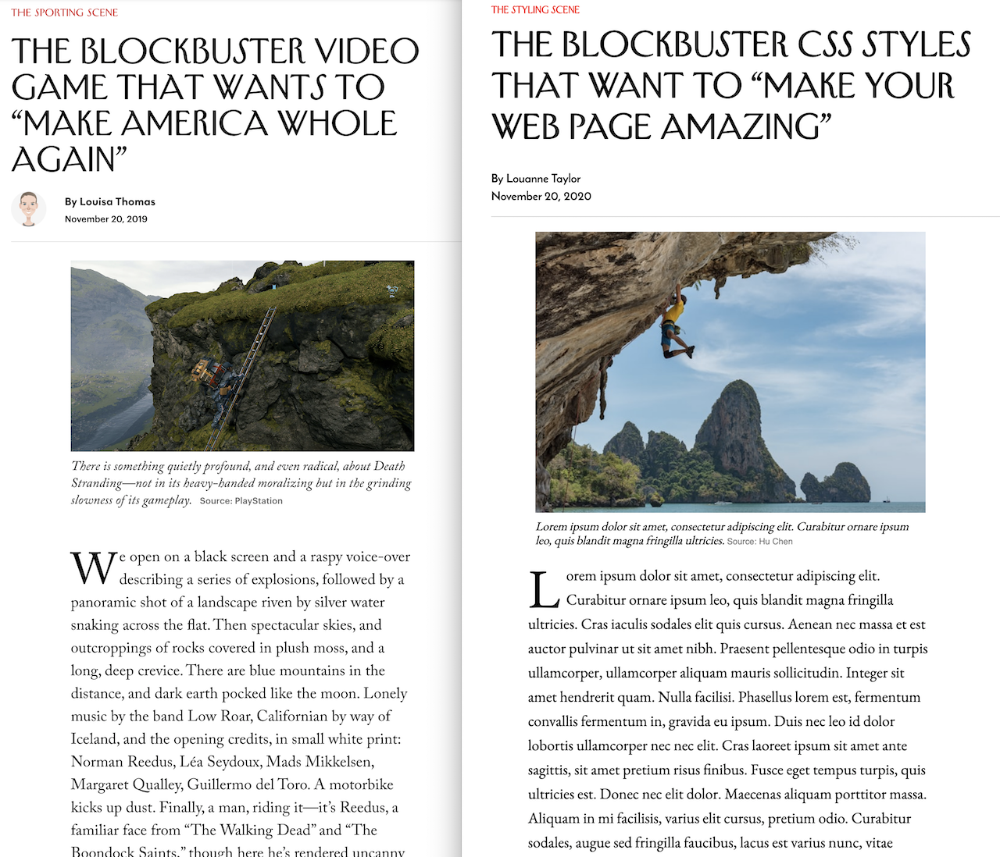

# WEB222 CSS Week 8 Walkthrough: Recreate a New Yorker Article

In this [video walkthrough](https://www.youtube.com/watch?v=nAtHHDVsGAY) we use the basic CSS text styling we learn in
[WEB222 Week 8](https://web222.ca/weeks/week08/) to make an HTML
document look like [this New Yorker article](https://www.newyorker.com/sports/sporting-scene/the-blockbuster-video-game-that-wants-to-make-america-whole-again).

- [YouTube Video Walkthrough](https://www.youtube.com/watch?v=nAtHHDVsGAY)
- [Final web page result](https://humphd.github.io/recreate-newyorker-css/)

## Assets

To create this we use the following free assets and tools:

- https://unsplash.com/photos/FZ0qzjVF_-c
- https://developers.google.com/speed/webp#webp_converter_download
- https://www.onlinewebfonts.com/download/1e44faec07b8b81f60a3215d76bd0086
- https://fonts.google.com/specimen/EB+Garamond
- https://fonts.google.com/specimen/Reem+Kufi
